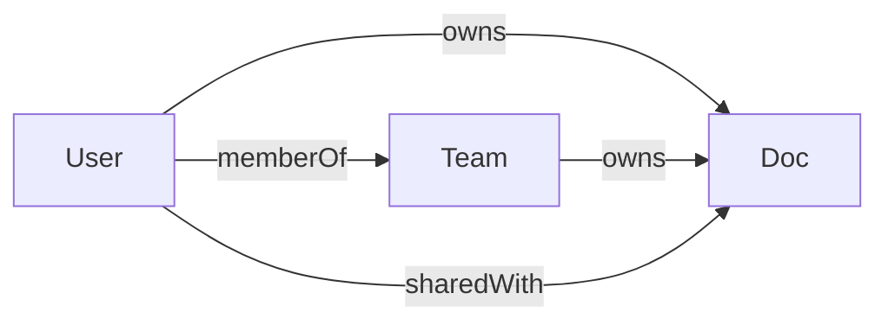

## Overview

Relationship-Based Access Control (ReBAC) grants permissions based on how entities relate to each other — ownership, team membership, sharing, and so on — rather than just roles or static flags.

Permix already supports ReBAC patterns out of the box. Because rule functions receive the resource at **check time** and capture the actor at **setup time**, you can encode any relationship predicate without a new API.



## Why no new API is needed

When you call `setup()`, each rule closure captures the current user (the **actor**). When you call `check()`, you pass the resource. The closure decides yes/no by inspecting the relationship between the two:

```ts
permix.setup({
  doc: {
    update: (doc) => doc.authorId === currentUser.id,
  },
});
```

This is ReBAC: the permission depends on a **relation** (author ↔ document) rather than a role flag. The sections below show three progressively richer patterns.

## Ownership

The simplest relation — the user who created a resource can modify it.

```ts
import { createPermix } from 'permix';

interface Doc {
  id: string;
  authorId: string;
}

const permix = createPermix<{
  doc: [
    'read',
    { name: 'update'; type: Doc; required: true },
    { name: 'delete'; type: Doc; required: true },
  ];
}>();

const currentUser = { id: 'user-1' };

permix.setup({
  doc: {
    read: true,
    update: (doc) => doc.authorId === currentUser.id,
    delete: (doc) => doc.authorId === currentUser.id,
  },
});

const myDoc = { id: 'doc-1', authorId: 'user-1' };
const otherDoc = { id: 'doc-2', authorId: 'user-2' };

permix.check('doc.update', myDoc); // true
permix.check('doc.update', otherDoc); // false
```

## Team membership

Users belong to teams; a team member can read any document owned by their team.

```ts
import { createPermix } from 'permix';

interface Doc {
  id: string;
  authorId: string;
  teamId: string;
}

interface User {
  id: string;
  teamIds: string[];
}

const permix = createPermix<{
  doc: [
    { name: 'read'; type: Doc; required: true },
    { name: 'update'; type: Doc; required: true },
  ];
}>();

function setupForUser(me: User) {
  permix.setup({
    doc: {
      read: (doc) => me.teamIds.includes(doc.teamId),
      update: (doc) => doc.authorId === me.id,
    },
  });
}

const alice: User = { id: 'alice', teamIds: ['team-a'] };
setupForUser(alice);

const teamDoc = { id: 'doc-1', authorId: 'bob', teamId: 'team-a' };
const otherTeamDoc = { id: 'doc-2', authorId: 'charlie', teamId: 'team-b' };

permix.check('doc.read', teamDoc); // true — same team
permix.check('doc.read', otherTeamDoc); // false — different team
permix.check('doc.update', teamDoc); // false — alice is not the author
```

You can extract this into a reusable [template](/docs/guide/template):

```ts
const memberPermissions = permix.template((me: User) => ({
  doc: {
    read: (doc) => me.teamIds.includes(doc.teamId),
    update: (doc) => doc.authorId === me.id,
  },
}));

setupForUser(alice);
// is equivalent to:
permix.setup(memberPermissions(alice));
```

## Document sharing

A sharing model where documents can be shared with individual users at different levels: `read`, `write`, or `admin`. Combine ownership and sharing in a single rule set.

```ts
import { createPermix } from 'permix';

interface Doc {
  id: string;
  authorId: string;
  teamId: string;
}

type ShareLevel = 'read' | 'write' | 'admin';

// In a real app this would come from your database
const shares = new Map<string, Map<string, ShareLevel>>();

function hasShare(
  docId: string,
  userId: string,
  minLevel: ShareLevel
): boolean {
  const level = shares.get(docId)?.get(userId);
  if (!level) return false;

  const rank: Record<ShareLevel, number> = { read: 0, write: 1, admin: 2 };
  return rank[level] >= rank[minLevel];
}

const permix = createPermix<{
  doc: [
    { name: 'read'; type: Doc; required: true },
    { name: 'update'; type: Doc; required: true },
    { name: 'admin'; type: Doc; required: true },
  ];
}>();

interface User {
  id: string;
  teamIds: string[];
}

function setupForUser(me: User) {
  const isOwner = (doc: Doc) => doc.authorId === me.id;
  const isTeammate = (doc: Doc) => me.teamIds.includes(doc.teamId);

  permix.setup({
    doc: {
      read: (doc) =>
        isOwner(doc) || isTeammate(doc) || hasShare(doc.id, me.id, 'read'),
      update: (doc) => isOwner(doc) || hasShare(doc.id, me.id, 'write'),
      admin: (doc) => isOwner(doc) || hasShare(doc.id, me.id, 'admin'),
    },
  });
}
```

You can combine checks using the callback form:

```ts
const doc: Doc = { id: 'doc-1', authorId: 'alice', teamId: 'team-a' };

// "Can the user either read OR administrate this doc?"
permix.check((c) => c('doc.read', doc) || c('doc.admin', doc));
```

## When to reach for something else

<Callout>
  The closure pattern works well when the relation data is **already in memory**
  at `setup()` or `check()` time. If your relations require async lookups from a
  database on every check, or you need a graph traversal engine (e.g.
  hierarchical folder permissions), the pattern above may become cumbersome.
  Follow [this issue](https://github.com/letstri/permix/issues/25) for updates
  on first-class ReBAC support in a future version.
</Callout>
